# android apk java层逆向破解分析

## 简介
每当观看电视剧时系统提示充值VIP才能观看下一集，每当游戏进行到关键时刻时系统提示你充值才能继续游戏，每当你和女神聊天时系统提示充值后才能继续和女神聊天，你是否遇到以上的烦恼，来学习逆向破解课程，解放你的双手，手把手教你如何破解一款APP，解决一切烦恼，走上人生巅峰

## 成果演示

_example.mp4：位于当前路径下_

## 涉及知识点

+ smali语言
+ apktool破解工具
+ jadx-gui工具

## 破解目标
一键完成试玩任务，省去中间争抢任务、下载APK、试玩任务等繁琐耗时流程


 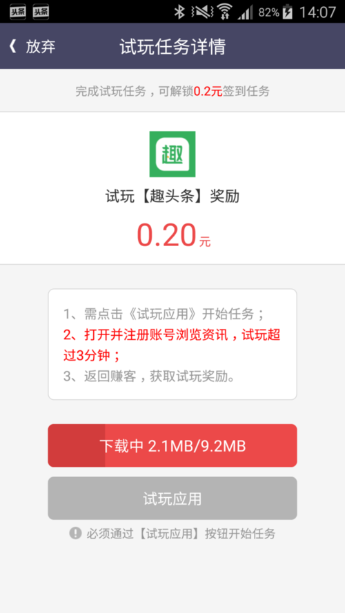
 

## 破解深入分析
__猜想：__

正常流程中的每一次争抢任务、点击下载和点击试玩应用应当是与服务器的每一次交互，我们只需要拿到每个操作的接口，附上接口参数，然后依次调用每个接口即可完成一次试玩任务，所以我们最终的目标是__获取apk的试玩任务中的每个网络接口的具体信息__

__可能存在的难点：__

+ 接口、参数是什么或者参数知道，但是是加密的？
+ 代码混淆、部分核心代码native化
+ apk加密、签名验证等问题


## 开始破解

### 解包
[apktool][1]工具

```
java -jar apktool.jar -fo out
```

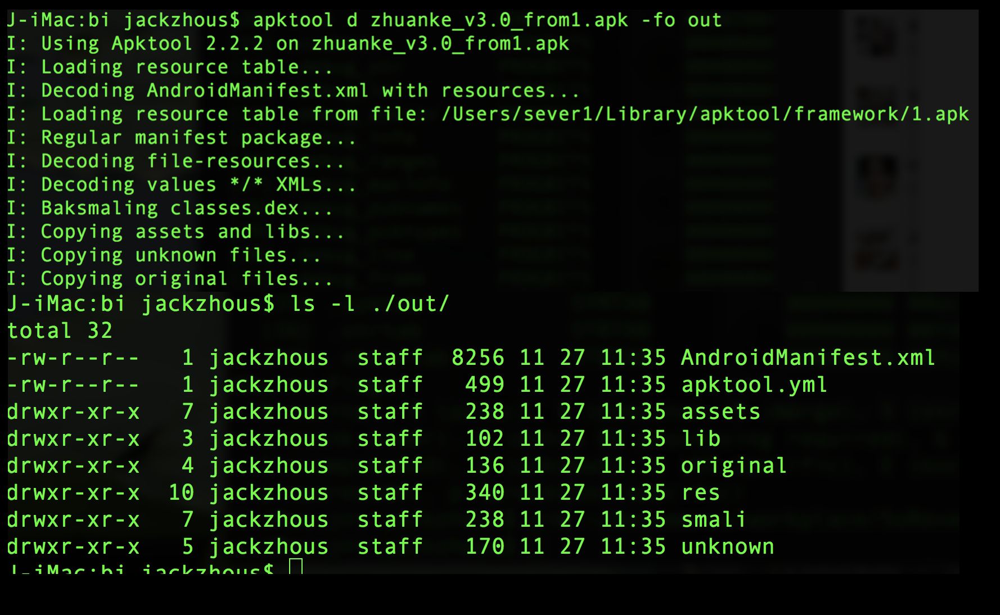
[smali语言简单介绍][2]

_这里解包的目的是为了植入我们的smali代码，查看调试信息的_

### 以‘关键字’入手点
在上图任务列表中，有'试玩'、‘高额’、‘签到’和‘截图’等关键字，我们解开apk包后，通过搜索关键字找到这个页面，查看内部页面逻辑，找到调用接口；找准对应组件的监听事件，完成接口的查找

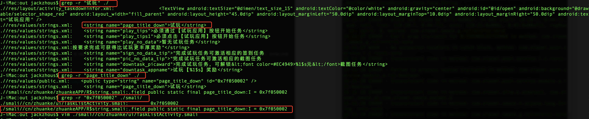

__查找到cn/zhuanke/ui/TaskListActivity.smali__


### 查看代码逻辑

这个步骤是需要细心并且耐心查看代码逻辑，找到其中的组件调用的网络访问接口；

[Jadx-gui反编译工具][3]，直接打开apk文件，查看Java代码

#### TaskListActivity

这里代码做了混淆，这个TaskListActivity没有onCreate方法，经过逻辑查看，图中b方法是父类定义的抽象方法，子类实现相当于是onCreate方法
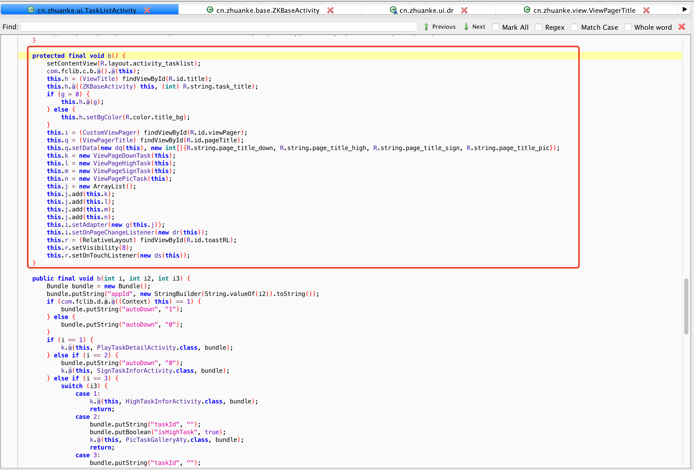

里面的ViewPageDownTask就是试玩任务添加的类，进入查看

```java
 		this.q.setData(new dq(this), new int[]{R.string.page_title_down, R.string.page_title_high, R.string.page_title_sign, R.string.page_title_pic});
        this.k = new ViewPageDownTask(this);
        this.l = new ViewPageHighTask(this);
        this.m = new ViewPageSignTask(this);
        this.n = new ViewPagePicTask(this);
```

#### ViewPageDownTask

该类的视图布局为ListView，也正好符好了试玩任务的布局

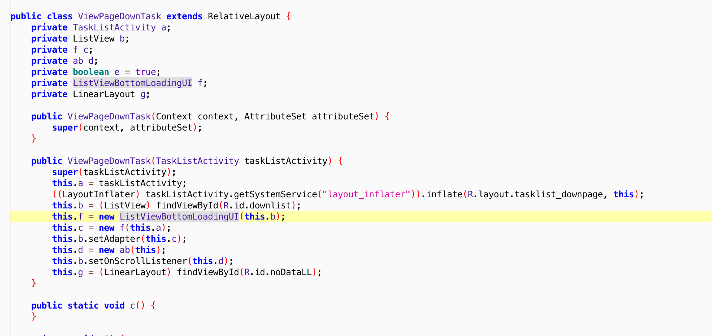

重点关注ListView组件，因为点击事件是从这里出发的

```java-
		this.b = (ListView) findViewById(R.id.downlist);
        this.f = new ListViewBottomLoadingUI(this.b);
        this.c = new f(this.a);
        this.b.setAdapter(this.c);
        this.d = new ab(this);
```

#### ListView的Adapter

adpter方法里面有几个汉字的关键字‘恭喜抢到任务’，这个是抢到后的提示，也就说明网络请求后的回调会调用这个方法，这个时候使用jadx-gui的find-usage找到其出处

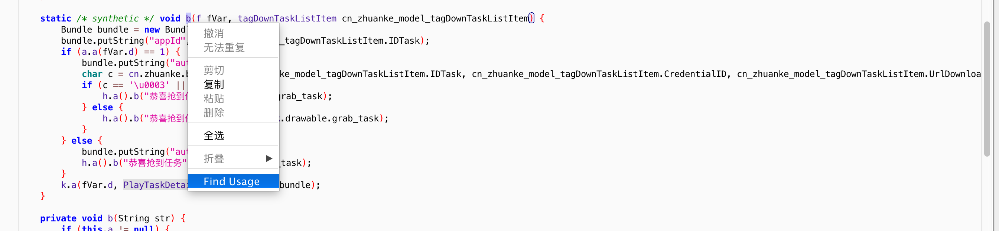

经过中间的find-usage找到了最终的调用地方

```java
final class i implements Runnable {
    final /* synthetic */ f a;
    private final /* synthetic */ tagDownTaskListItem b;

    i(f fVar, tagDownTaskListItem cn_zhuanke_model_tagDownTaskListItem) {
        this.a = fVar;
        this.b = cn_zhuanke_model_tagDownTaskListItem;
    }

    public final void run() {
        Map hashMap = new HashMap();
        hashMap.put("IDTask", new StringBuilder(String.valueOf(this.b.IDTask)).toString());
        f.a();
        String a = b.a(hashMap, "leeencry");
        ZKBaseActivity a2 = this.a.d;
        a2.getClass();
        f.a(this.a.d, "http://api.zhuanke.cn/api/lee/v1/xianshi/rob", a, new j(this, a2, this.b));
    }
}

```

上面一些列的逻辑代码分析，查找到疑似为争抢任务的接口，这个时候我们要往里面加入代码来验证是否为这个接口，注入代码不能直接添加Java代码，只能添加smali代码

#### 验证接口

验证思想，植入调试代码，打印接口的输出数据，并配合PC上进行手机抓包，抓到的数据查看这个接口的发送数据和日志打印的数据是否一致或者相关，如果是就能说明调用的是同一个接口；

__插入一个小点，抓包工具Windows上建议使用Fiddler，Mac系统上使用Charles，两个工具使用都是一样的，在PC和手机处于同一个局域网里面，PC配置好端口，手机配置代理服务器地址和端口即可进行抓包__

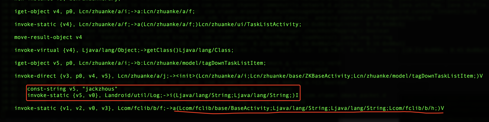

植入成功后，用apktool工具合上包、签名安装到手机，在配置好抓包工具即可；启动进行抓包，下图是结果对比：

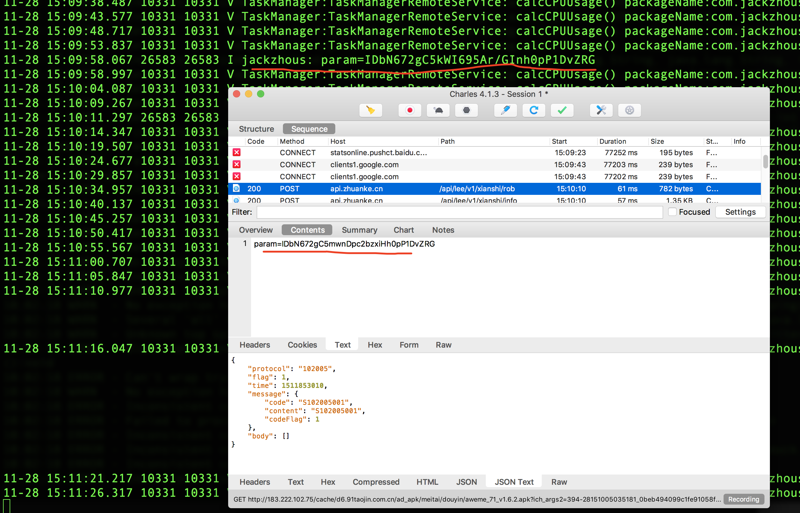

上图说明找的接口我们找对了，接下来就是分析这个加密字符串，加密字符串在上面那个加密算法之前是明文，植入代码打印输出这个明文即可；

#### 加密

加密算法不需要去理解细节，需要的时候直接粘贴复制拿过来即可

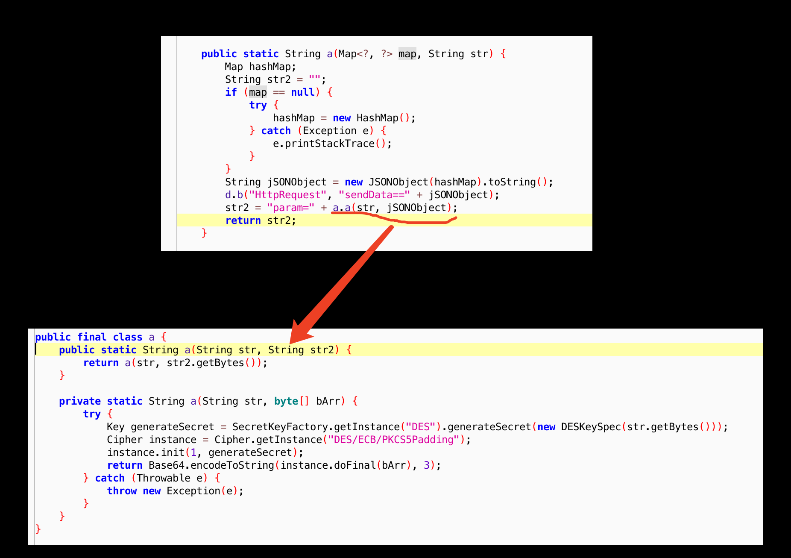

加入调试代码

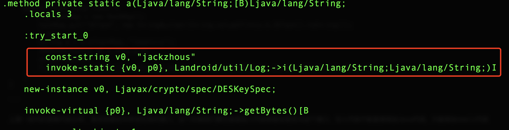

打印输出调试信息


至此，已经弄清楚这个争抢rob任务的接口、参数以及加密方式了

```java
// POST http://api.zhuanke.cn/api/lee/v1/xianshi/rob
// {"IDTask":"1234"}
//使用的加密算法
private static String a(String str, byte[] bArr) {
        try {
            Key generateSecret = SecretKeyFactory.getInstance("DES").generateSecret(new DESKeySpec(str.getBytes()));
            Cipher instance = Cipher.getInstance("DES/ECB/PKCS5Padding");
            instance.init(1, generateSecret);
            return Base64.encodeToString(instance.doFinal(bArr), 3);
        } catch (Throwable e) {
            throw new Exception(e);
        }
    }
```

#### 总结

网络接口字符串直接写在源代码中，很直观的看出这就是调用接口了，而且加密算法也在java中，只要看到加密算法直接粘贴复制就能够破解，不需要知道你是什么样的算法，所以最好是把加密算法写到ndk中

### 签名验证问题
直接修改smali代码和包apk是无法运行的，apk做了签名验证，解决方法和上面的寻找接口一样，从关键字入手找到apk验证的key，把原apk里面的签名直接复制过来使用即可

#### 现象

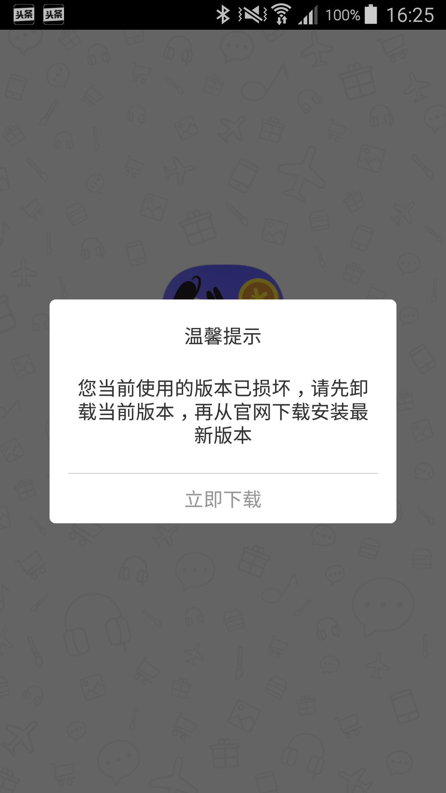

#### 代码逻辑

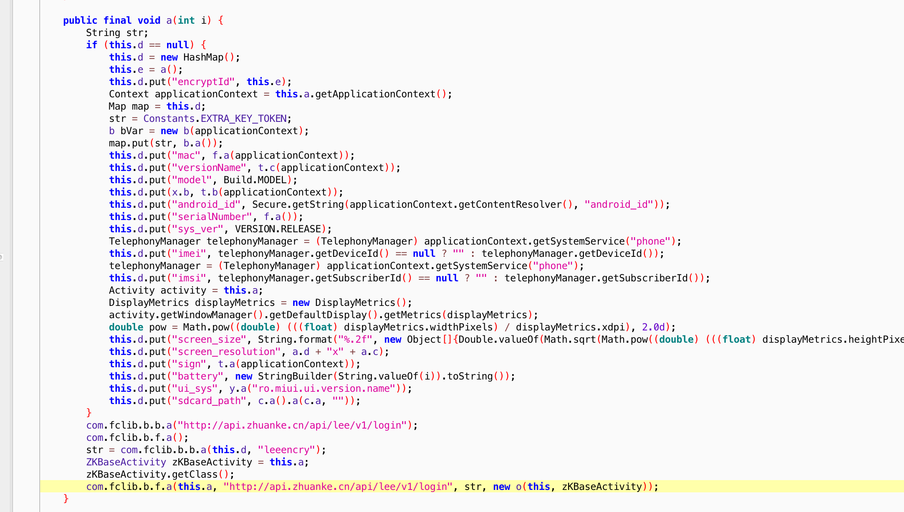

#### 修改逻辑

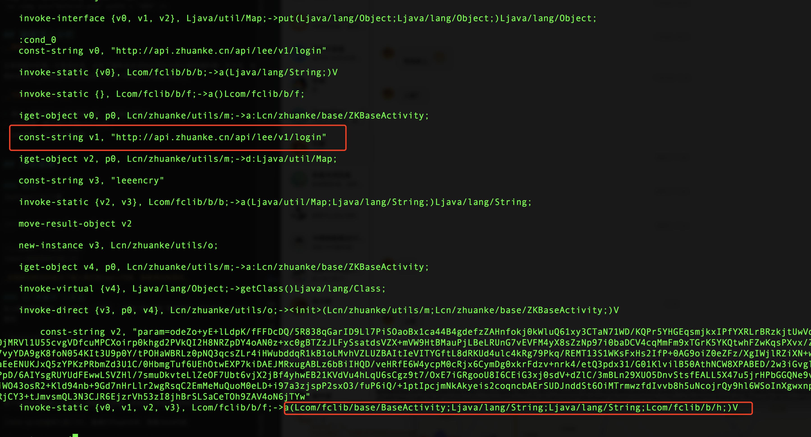

#### 总结

apk签名验证数据恒定不变，这种方法比较简单，只要知道这个传输数据就能破解了；我觉得每次登陆之前先从服务器多去一个加密的key，在根据这个key和客户端的签名一起加密，保证每次验证都是变化的，这样就能解决验证被破解的难度


[1]:https://github.com/iBotPeaches/Apktool
[2]:https://www.cnblogs.com/pursuitofacm/p/6736830.html
[3]:https://github.com/skylot/jadx