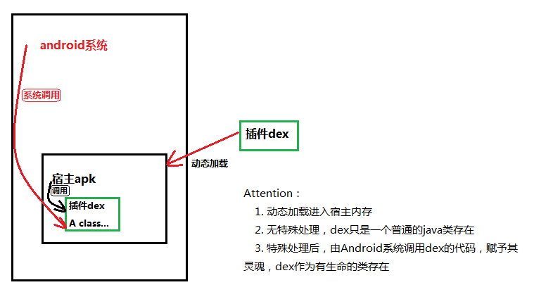
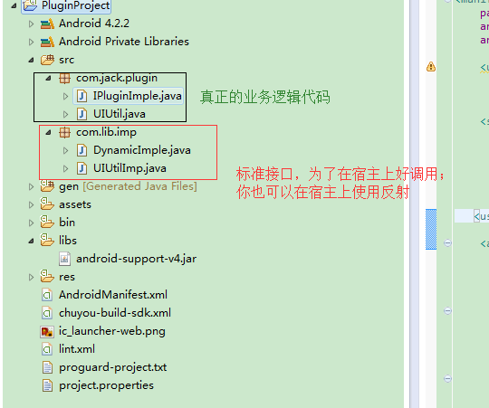

# Android插件化
## 来源及使用

随着业务功能慢慢的增加，apk的体积会越来越大，为了减小包的体积，可以利用Android的动态加载技术实现Android插件化，使用Android插件化开发，安装apk包体积减小，用户可以根据自己的需要安装下载插件，不需要的时候卸载；Android的动态加载技术不仅仅可以用到插件化上，还可以用于apk的热更，安全加壳等

## Android动态加载技术
所谓动态加载技术，就是在apk应用程序在运行时，动态加载apk、dex等包，加载到内存当中运行，动态加载技术需要了解Android的ClassLoader、ActivityThread、java反射以及Android的资源加载知识；通常来说动态加载技术大致分为以下几个步骤（宿主工程；被加载进去的包，以下简称插件dex）

+ 提供插件dex，不仅限于dex，可以是apk或者zip等
+ 使用ClassLoader将dex加载到内存
+ 利用ClassLoader的loadClass加载你需要的类
+ 使用加载的类执行它自己的逻辑功能

__注意Attention：__上述第三步加载你需要的类后，如果这个类时Android的四大组件，如Activity类似有生命周期方法，则需要你在做一些额外工作；生命周期是由Android系统来调用的，所以这里就需要使用反射来获取Android系统的API，让它管理我们的加载类，这样我们的类就有了灵魂，有正常的生命周期方法了；



原理容易，但实现起来就很复杂，要想系统调用它的生命周期，首先你就得分析类似于Activity、Service这样的组件生命周期在framework层是如何运行的，后面会做简单的介绍讲解

## ClassLoader
Android系统上，加载class的有两种：__DexClassLoader和PathClassLoader__

+ DexClassLoader可以自定义load路径，并且可以把apk文件解析后输出dex文件，所以DexClassLoader需要提供输入apk和输出路径
+ PathClassLoader不能自定义load路径，它固定解析/data/app路径下的内容，并且也不能主动释放出apk里面的内容

除此之外，还需要了解classLoader的__双亲委派机制__,简而言之就，就是：每个ClassLoader都有一个父的ClassLoader，当加载某一个Class的时候会先去父ClassLoader查询，如果父类已经加载过这个Class时就直接获取就行，不再去加载；反之，则自己去加载；
还有一点，Android的classLoader从dex1中加载出了com.jack.A;与此同时，另一个ClassLoader又从dex2中加载出com.jack.A;这种情况是不允许的，__相同的类不允许在不同的dex解析出来__

## 普通java类的动态加载
1. 宿主项目 --- MainProject
2. 插件工程 --- PluginProject

+ 插件工程完成正常的业务逻辑
+ 宿主工程主要完成dex的加载，找到相应的class并执行即可

### 插件工程



指定插件标准接口，宿主项目能更好的使用
```java
//插件接口
public interface DynamicImple {

	public void init();
	
	public void makeToast(Context context, String meg);
	
}

//业务逻辑
public class IPluginImple implements DynamicImple{

	private static final String TAG = "jackzhous";
	
	@Override
	public void init() {
		// TODO Auto-generated method stub
		Log.i(TAG, "plugin method init()");
	}

	@Override
	public void makeToast(Context context, String meg) {
		// TODO Auto-generated method stub
		Log.i(TAG, "plugin method makeToast()");
		Toast.makeText(context, "plugin: " + meg, Toast.LENGTH_SHORT).show();
	}
}

```
完成插件工程后，到处为apk，最后需要使用apktool解包把插件接口代码删掉，在合包成apk使用；删掉的目的是为了防止插件dex和宿主dex都有这个接口

### 宿主项目
```java
	//使用DexClassLoader加载dex
	private DexClassLoader initClassLoader(){
		String apkPath = Environment.getExternalStorageDirectory() + File.separator + "PluginProject.apk";
		String dexOutPath = getCacheDir().getAbsolutePath();
		//参数分别为源apk路径 输出路径  libarary库路径和父类classLoader
		DexClassLoader dexL = new DexClassLoader(apkPath, dexOutPath, null, getClassLoader());
		
		loadResources(apkPath);
		return dexL;
	}
	

	//加载插件当中的代码
	@SuppressLint("NewApi") public void doInit(View v) {
		if(loader != null){
			try {
				Class pluginClass = loader.loadClass("com.jack.plugin.IPluginImple");
				
				Object obj = pluginClass.newInstance();
				//使用接口方式，效率快一些
				if(obj instanceof DynamicImple){
					DynamicImple imple = (DynamicImple)obj;
					imple.init();
				}
				
				
				//也可以使用放射方式,但是这种效率比较低，原因主要是在getMethod和getField里面
				//Method method = pluginClass.getMethod("init", null);
				//method.invoke(obj, null);
				
			} catch (ClassNotFoundException e) {
				// TODO Auto-generated catch block
				e.printStackTrace();
			} catch (InstantiationException e) {
				// TODO Auto-generated catch block
				e.printStackTrace();
			} catch (IllegalAccessException e) {
				// TODO Auto-generated catch block
				e.printStackTrace();
			}catch (IllegalArgumentException e) {
				// TODO Auto-generated catch block
				e.printStackTrace();
			} /*catch (NoSuchMethodException e) {
				// TODO Auto-generated catch block
				e.printStackTrace();
			}  catch (InvocationTargetException e) {
				// TODO Auto-generated catch block
				e.printStackTrace();
			}*/
		}

	}

	//如果需要使用插件当中的资源需要在做以下工作
	/*============================使用插件的资源需要做如下处理==========================================*/
	/**
	 * 1. 将插件资源add进来
	 * 2. 使用该资源并获得Resource索引
	 * 3. 重写父类方法使用Resource即可
	 */
	
	private AssetManager mAssetManager;
	private Resources    mResources;
	private Theme        mTheme;
	
	protected void loadResources(String dexPath) {    
        try {    
            AssetManager assetManager = AssetManager.class.newInstance();    
            Method addAssetPath = assetManager.getClass().getMethod("addAssetPath", String.class);    
            addAssetPath.invoke(assetManager, dexPath);    
            mAssetManager = assetManager;    
        } catch (Exception e) {    
            e.printStackTrace();    
        }    
        Resources superRes = super.getResources();    
        superRes.getDisplayMetrics();    
        superRes.getConfiguration();    
        mResources = new Resources(mAssetManager, superRes.getDisplayMetrics(),superRes.getConfiguration());    
        mTheme = mResources.newTheme();    
        mTheme.setTo(super.getTheme());  
    }  
	
	
	@Override    
	public AssetManager getAssets() {    
	    return mAssetManager == null ? super.getAssets() : mAssetManager;    
	}    
	  
	@Override    
	public Resources getResources() {    
	    return mResources == null ? super.getResources() : mResources;    
	}    
	  
	@Override    
	public Theme getTheme() {    
	    return mTheme == null ? super.getTheme() : mTheme;    
	}  
	/*============================使用插件的资源需要做如下处理==========================================*/
	
	//使用插件资源
	
	@SuppressLint("NewApi") public void doPicture(View v) {
		if(loader != null){
			try {
				Class pluginUiutilClass = loader.loadClass("com.jack.plugin.UIUtil");
				
				Object obj0 = pluginUiutilClass.newInstance();
				
				Drawable message = ((UIUtilImp)obj0).getDrawableFromPlugin(this, 0);
				
				mImageView.setImageDrawable(message);
				
				
			} catch (ClassNotFoundException e) {
				// TODO Auto-generated catch block
				e.printStackTrace();
			} catch (InstantiationException e) {
				// TODO Auto-generated catch block
				e.printStackTrace();
			} catch (IllegalAccessException e) {
				// TODO Auto-generated catch block
				e.printStackTrace();
			}
		}
```
把插件工程按照上面的操作后拷贝到手机目录下，在运行宿主项目就可以执行插件的东西了

[项目下载demo][1]

## 有生命周期类的动态加载
以Activity的动态加载为例，大的分类有两种：

+ 反射方式替换宿主项目的ClassLoader或者反射合并宿主和插件的pathList，pathList里面存放了dex的索引
+ 静态代理方式，宿主ProxyActivity持有插件Activity的引用，ProxyActivity生命周期变化执行插件Activity对应变化

### 反射方式
#### 替换宿主ClassLoader
为什么替换ClassLoader后，就能够执行插件类的生命周期方法了？
众所周知，Activity由ClassLoader加载进来后就有ActivityThread来管理执行其生命周期，但是内部如何管理很复杂，不在此讲解，了解详情点击[这里][2],我们只需要知道加载Activity的ClassLoader在哪里即可，查看源码发现在ActivityThread的成员变量ArrayMap <String, WeakPreference<LoadApk>> mPackages，在LoadApk里面的ClassLoader里面，看到这逻辑，我们就可以用反射获取了


### 生命周期类的总结

+ 反射的方式需要在宿主项目的Androidmanifest.xml里面配置Activity组件信息，插件有多少个就需要配置多少个，一经ClassLoader就完成任务了
+ 静态代理不要在Androidmanifest.xml配置Activity信息，只需要配置代理Activity一个即可；需要管理手动的去管理插件中Activity的生命周期方法，难度复杂

### Java反射耗时在什么地方？
getMethod和getDeclaredField方法会比invoke和set方法耗时；


[1]:http://download.csdn.net/detail/jackzhouyu/9737182
[2]:http://blog.csdn.net/jackzhouyu/article/details/52608709