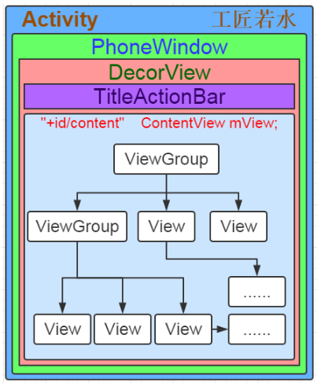
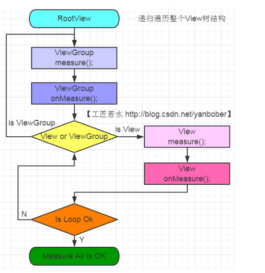
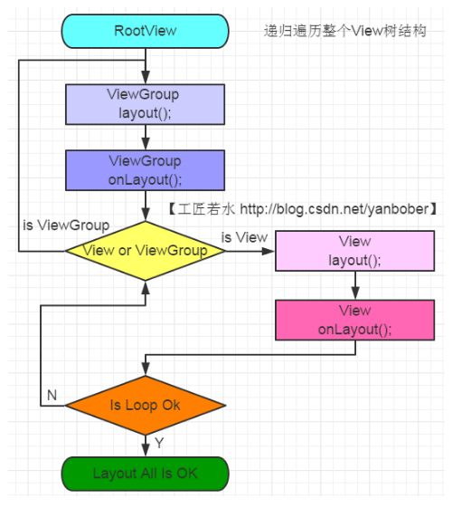
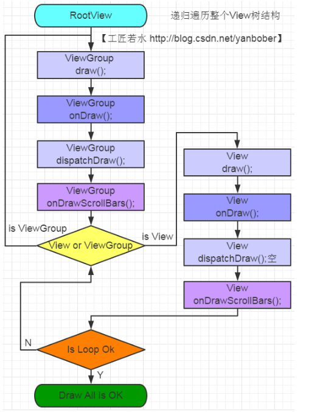

# Android组件View绘制流程原理分析

## android视图构成



如上图，Activity的window组成，Activity内部有个Window成员，它的实例为PhoneWindow，PhoneWindow有个内部类是DecorView，这个DecorView就是存放布局文件的，里面有TitleActionBar和我们setContentView传入进去的layout布局文件

+ Window类时一个抽象类，提供绘制窗口的API
+ PhoneWindow是继承Window的一个具体的类，该类内部包含了一个DecorView对象，该DectorView对象是所有应用窗口(Activity界面)的根View
+ DecorView继承FrameLayout，里面id=content的就是我们传入的布局视图

依据面向对象从抽象到具体我们可以类比上面关系就像如下：
Window是一块电子屏，PhoneWindow是一块手机电子屏，DecorView就是电子屏要显示的内容，Activity就是手机电子屏安装位置

### setContentView流程

__setContentView整个过程主要是如何把Activity的布局文件或者java的View添加至窗口里，重点概括为：__

1. 创建一个DecorView的对象mDecor，该mDecor对象将作为整个应用窗口的根视图。

2. 依据Feature等style theme创建不同的窗口修饰布局文件，并且通过findViewById获取Activity布局文件该存放的地方（窗口修饰布局文件中id为content的FrameLayout）。

3. 将Activity的布局文件添加至id为content的FrameLayout内。

4. 当setContentView设置显示OK以后会回调Activity的onContentChanged方法。Activity的各种View的findViewById()方法等都可以放到该方法中，系统会帮忙回调。

## android的View绘制
view绘制主要包括三个方面：

+ measure 测量组件本身的大小
+ layout  确定组件在视图中的位置
+ draw	  根据位置和大小，将组件画出来

视图绘制的起点在ViewRootImpl类的performTraversals()方法，该方法完成的工作主要是： __根据之前的状态，判定是否重新计算测试视图大小（measure）、是佛重新放置视图位置（layout）和是否重新重绘视图（draw）__ ，部分源码如下：

```java
private void performTraversals() {
        ......
        //最外层的根视图的widthMeasureSpec和heightMeasureSpec由来
        //lp.width和lp.height在创建ViewGroup实例时等于MATCH_PARENT
        int childWidthMeasureSpec = getRootMeasureSpec(mWidth, lp.width);
        int childHeightMeasureSpec = getRootMeasureSpec(mHeight, lp.height);
        ......
        mView.measure(childWidthMeasureSpec, childHeightMeasureSpec);
        ......
        mView.layout(0, 0, mView.getMeasuredWidth(), mView.getMeasuredHeight());
        ......
        mView.draw(canvas);
        ......
    }
```

### measure计算视图大小
几乎所有的组件都是继承View类的，而关于view的测量工作，日常开发用得多的方法就是measure和onMeasure两个方法，measure不可重写，当我们自定义时主要重写onMeasure方法即可，在方法内部我们必须完成组件的mMeasuredWidth和mMeasuredHeight实际尺寸测量，而这个尺寸是需要父视图和子视图共同决定的

measure流程从根视图measure遍历整个view树结构，如下：



还要注意视图尺寸MeasureSpec是一个组合尺寸，它是一个32位bit值，高两位是尺寸模式specMode，低30位是尺寸大小值，我们可以利用提供的原声库方法很方便的进行尺寸组合和拆解：
specMode有三种： MeasureSpec.EXACTLY表示确定大小， MeasureSpec.AT_MOST表示最大大小， MeasureSpec.UNSPECIFIED不确定
```java
int measureSpec = MeasureSpec.makeMeasureSpec(windowSize, MeasureSpec.EXACTLY);    //合成
int specMode = MeasureSpec.getMode(measureSpec);								   //拆解
int specSize = MeasureSpec.getSize(measureSpec);
```

而在视图测量meause中，父组件传给子组件的一般都是一个组合尺寸，我们可以拿出具体尺寸然后根据其他条件产生一个新的尺寸值，将这个值用setMeasuredDimension设置mMeasuredWidth和mMeasuredHeight具体尺寸，完成测量；

#### measure原理总结

+ MeasureSpec（View的内部类）测量规格为int型，值由高2位规格模式specMode和低30位具体尺寸specSize组成。其中specMode只有三种值：
```java
MeasureSpec.EXACTLY //确定模式，父View希望子View的大小是确定的，由specSize决定；
MeasureSpec.AT_MOST //最多模式，父View希望子View的大小最多是specSize指定的值；
MeasureSpec.UNSPECIFIED //未指定模式，父View完全依据子View的设计值来决定； 
```

+ View的measure方法是final的，不允许重载，View子类只能重载onMeasure来完成自己的测量逻辑。

+ 最顶层DecorView测量时的MeasureSpec是由ViewRootImpl中getRootMeasureSpec方法确定的（LayoutParams宽高参数均为MATCH_PARENT，specMode是EXACTLY，specSize为物理屏幕大小）。

+ ViewGroup类提供了measureChild，measureChild和measureChildWithMargins方法，简化了父子View的尺寸计算。

+ 只要是ViewGroup的子类就必须要求LayoutParams继承子MarginLayoutParams，否则无法使用layout_margin参数。

+ View的布局大小由父View和子View共同决定。

+ 使用View的getMeasuredWidth()和getMeasuredHeight()方法来获取View测量的宽高，必须保证这两个方法在onMeasure流程之后被调用才能返回有效值。

### layout视图位置确定

layout的流程主要也是遍历整个view树结构，调用view.layout(int l, int t, int r, int b)确定好view的具体坐标位置，流程图如下



当我们自定义一个组件时，通常时重写onLayout方法，里面实现好自己的逻辑，最后在调用layout方法完成视图位置确定，如果自定义组件时一个ViewGroup的话，还需要我们去遍历每一个child确定尺寸

#### layout原理总结
+ 整个layout过程比较容易理解，从上面分析可以看出layout也是从顶层父View向子View的递归调用view.layout方法的过程，即父View根据上一步measure子View所得到的布局大小和布局参数，将子View放在合适的位置上。具体layout核心主要有以下几点：

+ View.layout方法可被重载，ViewGroup.layout为final的不可重载，ViewGroup.onLayout为abstract的，子类必须重载实现自己的位置逻辑。

+ measure操作完成后得到的是对每个View经测量过的measuredWidth和measuredHeight，layout操作完成之后得到的是对每个View进行位置分配后的mLeft、mTop、mRight、mBottom，这些值都是相对于父View来说的。

+ 凡是layout_XXX的布局属性基本都针对的是包含子View的ViewGroup的，当对一个没有父容器的View设置相关layout_XXX属性是没有任何意义的（前面《Android应用setContentView与LayoutInflater加载解析机制源码分析》也有提到过）。

+ 使用View的getWidth()和getHeight()方法来获取View测量的宽高，必须保证这两个方法在onLayout流程之后被调用才能返回有效值。

### draw绘制

完成measure和Layout后，ViewRootImpl中的代码会创建一个Canvas对象，然后调用View的draw()方法来执行具体的绘制工。所以又回归到了ViewGroup与View的树状递归draw过程
先来看下View树的递归draw流程图，如下：



#### draw原理总结
可以看见，绘制过程就是把View对象绘制到屏幕上，整个draw过程需要注意如下细节：

+ 如果该View是一个ViewGroup，则需要递归绘制其所包含的所有子View。

+ View默认不会绘制任何内容，真正的绘制都需要自己在子类中实现。

+ View的绘制是借助onDraw方法传入的Canvas类来进行的。

+ 区分View动画和ViewGroup布局动画，前者指的是View自身的动画，可以通过setAnimation添加，后者是专门针对ViewGroup显示内部子视图时设置的动画，可以在xml布局文件中对ViewGroup设置layoutAnimation属性（譬如对LinearLayout设置子View在显示时出现逐行、随机、下等显示等不同动画效果）。

+ 在获取画布剪切区（每个View的draw中传入的Canvas）时会自动处理掉padding，子View获取Canvas不用关注这些逻辑，只用关心如何绘制即可。

+ 默认情况下子View的ViewGroup.drawChild绘制顺序和子View被添加的顺序一致，但是你也可以重载ViewGroup.getChildDrawingOrder()方法提供不同顺序。

## view提供的API控制视图的方法

### invalidate和postInvalidate方法源码分析
请求重新绘制视图，调用draw

+ invalidate在主线程调用
+ postInvalidate是在非主线程调用

### View的requestLayout方法
requestLayout()方法会调用measure过程和layout过程，不会调用draw过程，也不会重新绘制任何View包括该调用者本身。

本文参考于：[这里][1]

[1]:http://blog.csdn.net/yanbober/article/details/46128379


