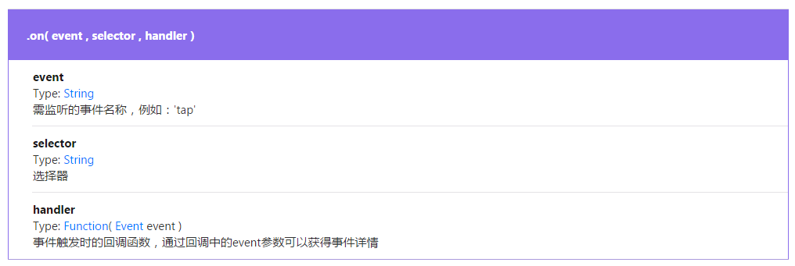
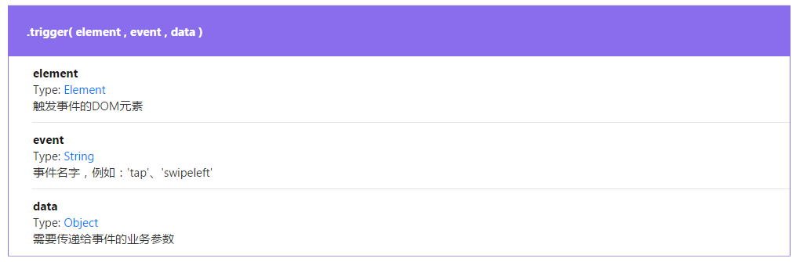
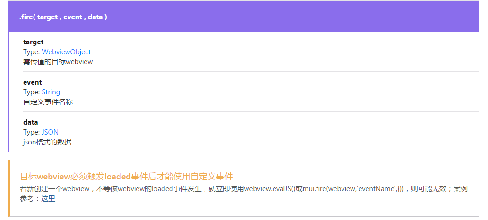
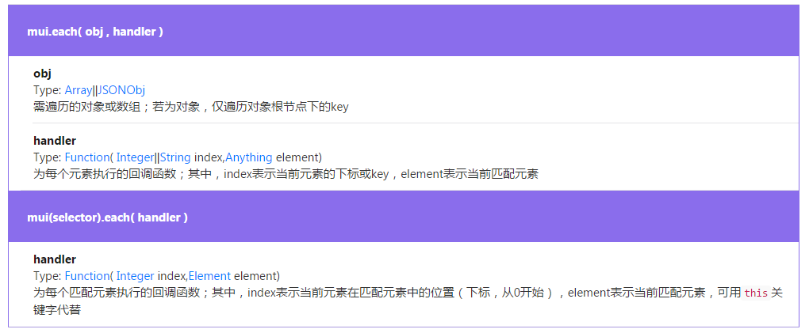
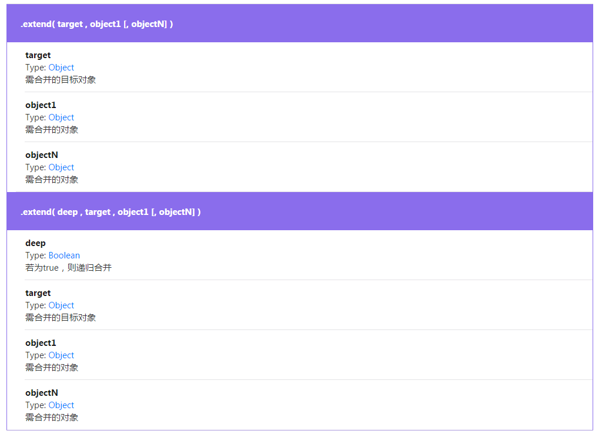
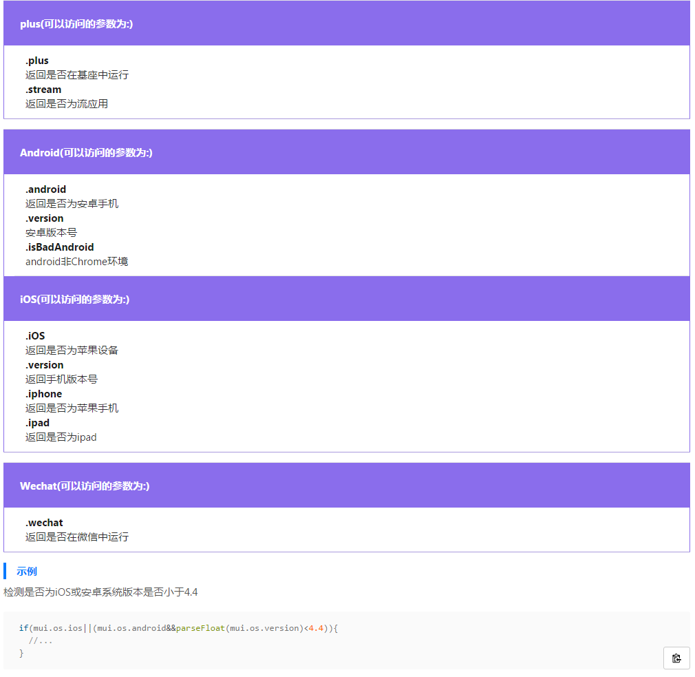

# MUI背景介绍
MUI是一套前端框架，由[DCLOUD公司][1]研发而成，提供大量H5和js语言组成的组件，大大提高了开发效率，可以用于开发web端应用、web app等应用。

# MUI API简介
[官方文档][2]

## 窗口方面api

### 关闭页面

+ 点击包含.mui-action-back类的控件
+ 在屏幕内，向右快速滑动
+ Android手机按下back按键

```javascript
//第一种方式
<button type="button" class='mui-btn mui-btn-danger mui-action-back'>关闭</button>

//第二种方式 默认没有启动，如需启动如下
mui.init({
	swipeBack:true 							//启用右滑关闭功能
});
```
除了如上三种操作外，也可以直接调用mui.back()方法，执行窗口关闭逻辑；
mui.back()仅处理窗口逻辑，若希望在窗口关闭之前再处理一些其它业务逻辑，则可将业务逻辑抽象成一个具体函数，然后注册为mui.init方法的beforeback参数;beforeback的执行逻辑为：

+ 执行beforeback参数对应的函数若返回false，则不再执行mui.back()方法；
+ 否则（返回true或无返回值），继续执行mui.back()方法；

示例：
```javascript
mui.init({
	beforeback: function(){
		//获得列表界面的webview
		var list = plus.webview.getWebviewById('list');
		//触发列表界面的自定义事件（refresh）,从而进行数据刷新
		mui.fire(list,'refresh');
		//返回true，继续页面关闭逻辑
		return true;
	}
});
```

### 预加载
所谓的预加载技术就是在用户尚未触发页面跳转时，提前创建目标页面，这样当用户跳转时，就可以立即进行页面切换，节省创建新页面的时间，提升app使用体验。mui提供两种方式实现页面预加载。
#### 方式一：通过mui.init方法中的preloadPages参数进行配置
```javascript
mui.init({
  preloadPages:[
    {
      url:prelaod-page-url,
      id:preload-page-id,
      styles:{},//窗口参数
      extras:{},//自定义扩展参数
      subpages:[{},{}]//预加载页面的子页面
    }
  ],
  preloadLimit:5//预加载窗口数量限制(一旦超出,先进先出)默认不限制
});
```
该种方案使用简单、可预加载多个页面，但不会返回预加载每个页面的引用，若要获得对应webview引用，还需要通过plus.webview.getWebviewById方式获得；另外，因为mui.init是异步执行，执行完mui.init方法后立即获得对应webview引用，可能会失败，

#### 方式二：通过mui.preload方法预加载
```javascript
var page = mui.preload({
    url:new-page-url,
    id:new-page-id,//默认使用当前页面的url作为id
    styles:{},//窗口参数
    extras:{}//自定义扩展参数
});
```
通过mui.preload()方法预加载，可立即返回对应webview的引用，但一次仅能预加载一个页面；若需加载多个webview，则需多次调用mui.preload()方法；

## 事件管理
### 事件绑定

+ document找寻id方式绑定  --- document.getElementById("id").onclick(function());
+ 添加事件回调            --- elementObject.addEventListener(eventName,handle,useCapture);
+ 使用mui框架进行事件绑定

使用.on()方法实现批量元素的事件绑定，方法介绍：



示例
```javascript
mui(".mui-table-view").on('tap','.mui-table-view-cell',function(){
  //获取id
  var id = this.getAttribute("id");
  //传值给详情页面，通知加载新数据
  mui.fire(detail,'getDetail',{id:id});
  //打开新闻详情
  mui.openWindow({
    id:'detail',
    url:'detail.html'
  });
}) 
```

### 事件取消
取消绑定，则可以使用off()方法。 off()方法根据传入参数的不同，有不同的实现逻辑。


### 事件触发
使用mui.trigger()方法可以动态触发特定DOM元素上的事件。



### 触发自定义事件
可以进行一些网页的跳转，mui.fire()



### 手势事件
移动端开发时，会有一些手势事件，点击tap，双击doubletap等，为了方便开放者快速集成这些手势，mui内置了常用的手势事件，目前支持的手势事件见如下列表：

| 分类        | 参数    |  描述  |
| --------   | -----:   | :----: |
| 点击        | tap      |   单机屏幕    |
| 点击        | doubletap     |  双击屏幕    |
| 长按        | 	longtap     |   长按屏幕   |
| 长按        | 	hold     |   按住屏幕   |
| 长按        | 	release     |   离开屏幕   |
| 滑动        | 	swipeleft     |   向左滑动   |
| 滑动        | 	swiperight     |   向右滑动   |
| 滑动        | 	swipeup     |   向上滑动   |
| 滑动        | 	swipedown     |   向下滑动   |
| 拖动        | 	dragstart     |   开始拖动   |
| 拖动        | 	drag      |   拖动  |
| 拖动        | 	dragend      |   结束拖动   |

### 监听上述动作

	mui框架默认会监听部分手势动作，如果需要监听你想要的动作，需要在初始化配置动作，mui.init的gestureConfig参数，如下代码：

```javascript
mui.init({
  gestureConfig:{
   tap: true, //默认为true
   doubletap: true, //默认为false
   longtap: true, //默认为false
   swipe: true, //默认为true
   drag: true, //默认为true
   hold:false,//默认为false，不监听
   release:false//默认为false，不监听
  }
});
```
__注意:__dragstart、drag、dragend共用drag开关，swipeleft、swiperight、swipeup、swipedown共用swipe开关

### 事件管理总结

+ 单个元素上的事件监听，建议使用addEventListener()，如elem.addEventListener("swipeleft",function()}
+ 多个元素上的事件监听，建议使用mui.on事件进行绑定

__从上面的api都会或多或少的了解部分mui提供的js函数，如mui.init(),但是只是了解函数的部分参数，下面将具体介绍下面一些函数的配置参数及功能__

## mui.init()
直接上代码，浅显易懂
```javascript
mui.init({
//子页面
	subpages: [{
		//...
	}],
//预加载
	 preloadPages:[
	    //...
 	 ],
//下拉刷新、上拉加载
 	pullRefresh : {
	   //...
     	},
//手势配置
 	 gestureConfig:{
	   //...
	},
//侧滑关闭
	swipeBack:true, //Boolean(默认false)启用右滑关闭功能
	
//监听Android手机的back、menu按键
	keyEventBind: {
		backbutton: false,  //Boolean(默认true)关闭back按键监听
		menubutton: false   //Boolean(默认true)关闭menu按键监听
	},
//处理窗口关闭前的业务
	beforeback: function() {
		//... //窗口关闭前处理其他业务详情点击 ↑ "关闭页面"链接查看
	},
//设置状态栏颜色
	statusBarBackground: '#9defbcg', //设置状态栏颜色,仅iOS可用
	preloadLimit:5//预加载窗口数量限制(一旦超出,先进先出)默认不限制
})
```

## mui()
mui使用css选择器获取HTML元素，返回mui对象数组。
mui("p")：选取所有<p>元素
mui("p.title")：选取所有包含.title类的<p>元素
若要将mui对象转化成dom对象，可使用如下方法（类似jquery对象转成dom对象）：
```javascript
//obj1是mui对象
var obj1 = mui("#title");
//obj2是dom对象
var obj2 = obj1[0]; 
```

## each()
each既是一个类方法，同时也是一个对象方法，两个方法适用场景不同；换言之，你可以使用mui.each()去遍历数组或json对象，也可以使用mui(selector).each()去遍历DOM结构。



### each遍历数组
```javascript
var array = [1,2,3]
mui.each(array,function(index,item){
  console.log(item*item);
}) 
```

### each遍历HTML输入标签

```html
<div class="mui-input-group">
  <div class="mui-input-row">
    <label>字段1：</label>
    <input type="text" class="mui-input-clear" id="col1" placeholder="请输入">
  </div>
  <div class="mui-input-row">
    <label>字段2：</label>
    <input type="text" class="mui-input-clear" id="col2" placeholder="请输入">
  </div>
  <div class="mui-input-row">
    <label>字段3：</label>
    <input type="text" class="mui-input-clear" id="col3" placeholder="请输入">
  </div>
</div>
```
提交时校验三个字段均不能为空，若为空则提醒并终止业务逻辑运行，使用each()方法循环校验，如下：
```javascript
var check = true;
mui(".mui-input-group input").each(function () {
  //若当前input为空，则alert提醒
  if(!this.value||trim(this.value)==""){
    var label = this.previousElementSibling;
    mui.alert(label.innerText+"不允许为空");
    check = false;
    return false;
  }
});
//校验通过，继续执行业务逻辑
if(check){
  //.....
}
```

## extend()
将两个对象合并成一个对象

### extend示例



```javascript
var target = {
  company:"dcloud",
  product:{
    mui:"小巧、高效"
  }
} 
var obj1 = {
  city:"beijing",
  product:{
    HBuilder:"飞一样的编码"
  }
}
mui.extend(target,obj1);
//输出：{"company":"dcloud","product":{"HBuilder":"飞一样的编码"},"city":"beijing"}
console.log(JSON.stringify(target));
```
### extend()深度合并
```javascript
var target = {
  company:"dcloud",
  product:{
    mui:"小巧、高效"
  }
} 
var obj1 = {
  city:"beijing",
  product:{
    HBuilder:"飞一样的编码"
  }
}
//支持深度合并
mui.extend(true,target,obj1);
//输出：{"company":"dcloud","product":{"mui":"小巧、高效","HBuilder":"飞一样的编码"},"city":"beijing"}
console.log(JSON.stringify(target));
```

## OS
我们经常会有通过navigator.userAgent判断当前运行环境的需求,mui对此进行了封装,通过调用mui.os.XXX即可



## plus
mui提供的plus可以很方便的访问系统的原声东西，如手机devices,还有webview等

## mui网络访问
mui框架基于htm5plus的XMLHttpRequest，封装了常用的Ajax函数，支持GET、POST请求方式，支持返回json、xml、html、text、script数据类型； 本着极简的设计原则，mui提供了mui.ajax方法，并在mui.ajax方法基础上，进一步简化出最常用的mui.get()、mui.getJSON()、mui.post()三个方法。

### 简单用法

__> mui.ajax( url [,settings] )__


url：请求发送的目标地址

settings：key/value格式的json对象，用来配置ajax请求参数，支持的参数如下：


data：发送到服务器的业务数据；

type：请求方式，目前仅支持'GET'和'POST'，默认为'GET'方式；

dataType：预期服务器返回的数据类型；如果不指定，mui将自动根据HTTP包的MIME头信息自动判断；
支持设置的dataType可选值：


"xml": 返回XML文档

"html": 返回纯文本HTML信息；

"script": 返回纯文本JavaScript代码

"json": 返回JSON数据

"text": 返回纯文本字符串


success：Type: Functon（Anything data,String textStatus,XMLHttpRequest xhr）
请求成功时触发的回调函数，该函数接收三个参数：


data：服务器返回的响应数据，类型可以是json对象、xml对象、字符串等；

textStatus：状态描述，默认值为'success'

xhr：xhr实例对象


error：Type: Functon（XMLHttpRequest xhr,String type,String errorThrown）请求失败时触发的回调函数；
该函数接收三个参数：


xhr：xhr实例对象

type：错误描述，可取值："timeout", "error", "abort", "parsererror"、"null"

errorThrown：可捕获的异常对象


timeout：Type: Number，请求超时时间（毫秒），默认值为0，表示永不超时；若超过设置的超时时间(非0的情况)，依然未收到服务器响应，则触发error回调；

headers：Type: Object,格式为：{'Content-Type'：'application/json'}，

```javascript
mui.ajax(url,{
    data:{
        username:'username',
        password:'password'
    },
    dataType:'json',//服务器返回json格式数据
    type:'post',//HTTP请求类型
    timeout:10000,//超时时间设置为10秒；
    success:function(data){
        //服务器返回响应，根据响应结果，分析是否登录成功；
        ...
    },
    error:function(xhr,type,errorThrown){
        //异常处理；
        console.log(type);
    }
});
```

__mui.post( url [,data] [,success] [,dataType] ) __
mui.post()方法是对mui.ajax()的一个简化方法，直接使用POST请求方式向服务器发送数据、且不处理timeout和异常（若需处理异常及超时，请使用mui.ajax()方法）

```javascript
mui.post('http://server-name/login.php',{
        username:'username',
        password:'password'
    },function(data){
        //服务器返回响应，根据响应结果，分析是否登录成功；
        ...
    },'json'
);
```

__> mui.get( url [,data] [,success] [,dataType] )__
mui.get()方法和mui.post()方法类似，只不过是直接使用GET请求方式向服务器发送数据、且不处理timeout和异常（若需处理异常及超时，请使用mui.ajax()方法）。如下为获得某服务器新闻列表的代码片段，服务器以json格式返回数据列表：

```javascript
mui.get('http://server-name/list.php',
    {category:'news'},
    function(data){
        //获得服务器响应
        ...
    },'json'
);
```

__> mui.getJSON( url [,data] [,success] )__
mui.getJSON()方法是在mui.get()方法基础上的更进一步简化，限定返回json格式的数据，其它参数和mui.get()方法一致，如上获得新闻列表的代码换成mui.getJSON()方法后，更为简洁，如下：

```javascript
mui.getJSON('http://server-name/list.php',
    {category:'news'},
    function(data){
        //获得服务器响应
        ...
    }
);
```


## mui组件
除上面的api之外，mui还提供了很多封装好的html组件，使用非常简单，在Hbuilder ide里面只需要敲m就会显示出支持的组件，使用非常方便，这里就不具体介绍使用方法了，如需了解详情，请点击一下链接访问

[mui组件链接][3]

[1]:http://www.dcloud.io/mui.html
[2]:http://dev.dcloud.net.cn/mui/window/#openwindow
[3]:http://dev.dcloud.net.cn/mui/snippet/